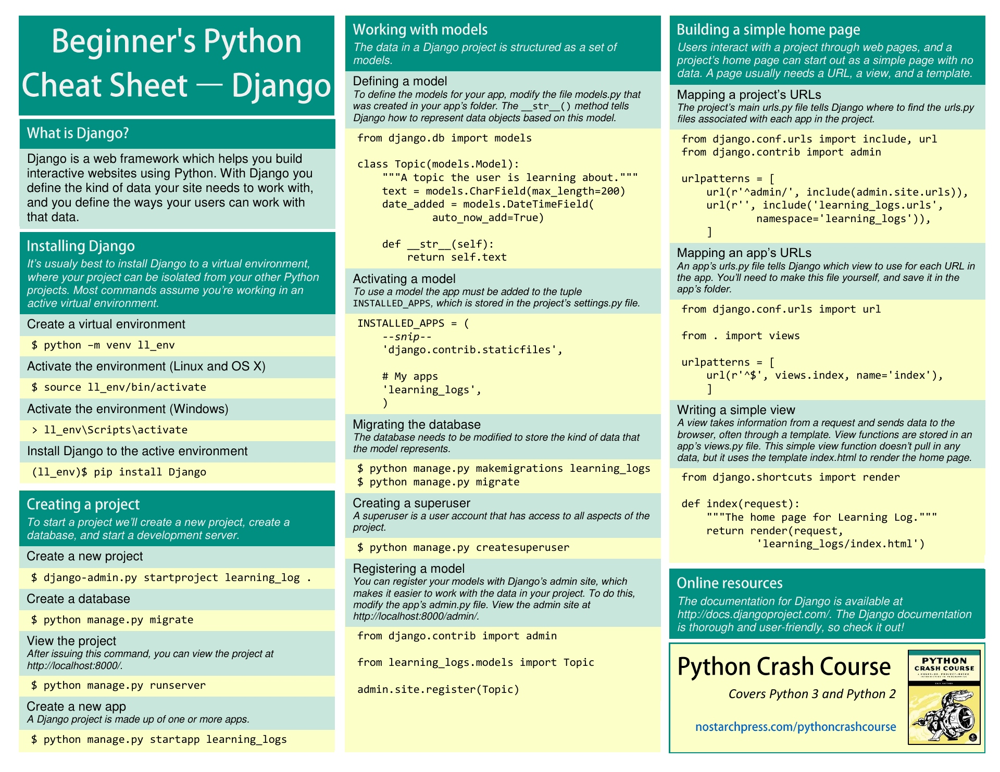
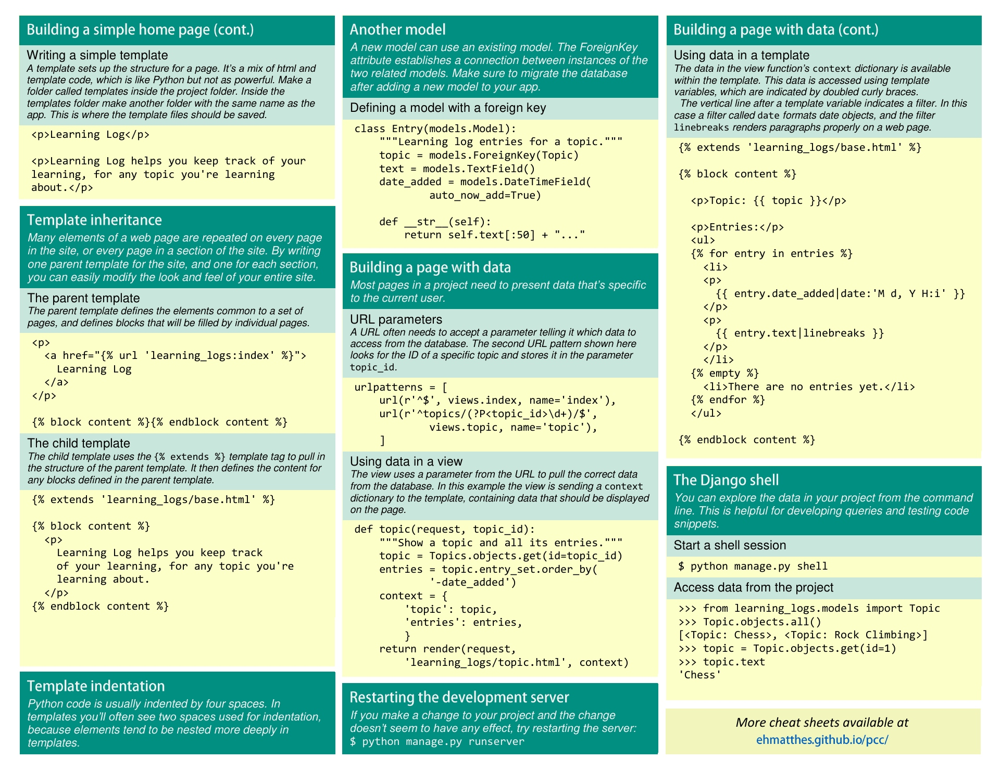
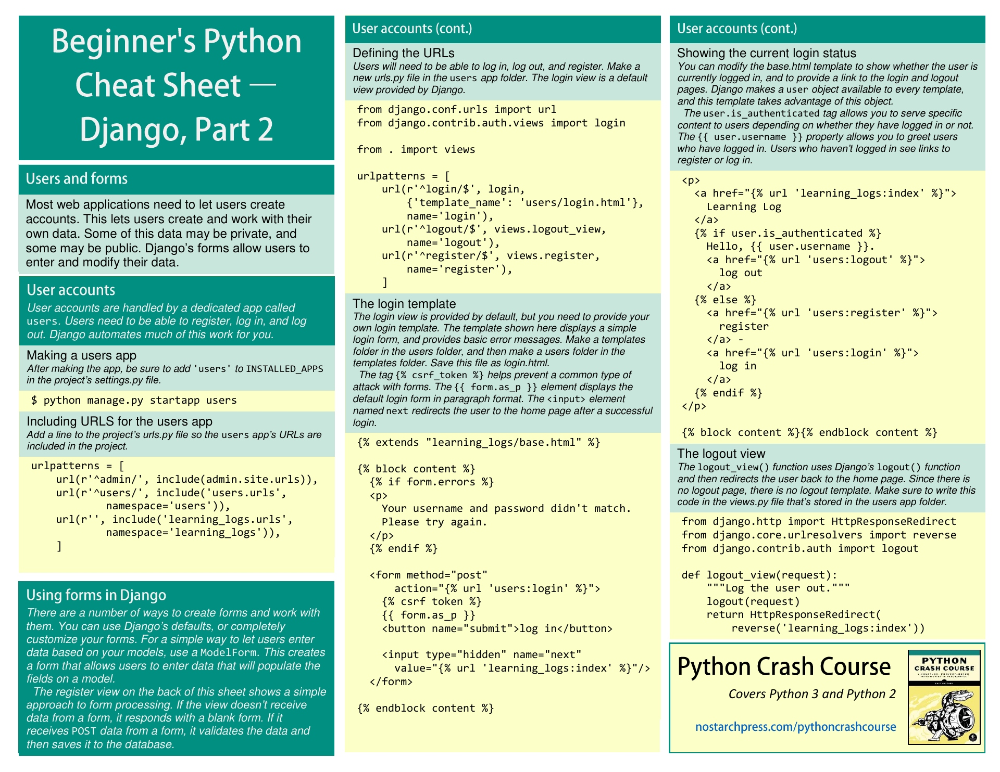
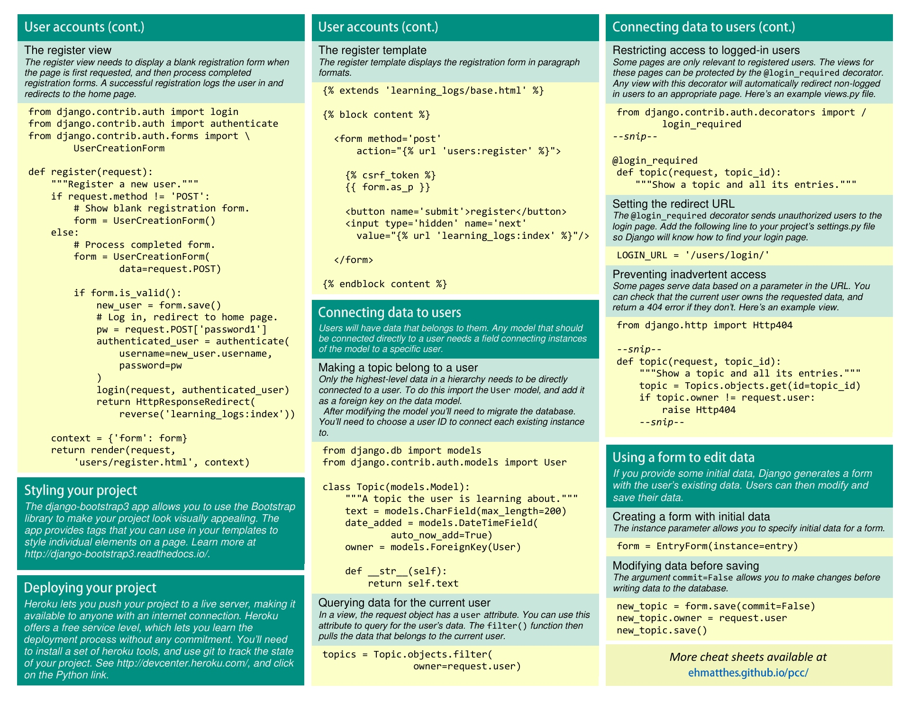

# mysite
It will be first website ever made by me 

## CHEATSHEET

## Installation

> What should I do:  
>* virtual environment 
>* install Django
>* create **requirements.txt** file

## Create Project

> What should I do:
>* `django-admin.py startproject mysite . `  
> Dot at the end means *create project* in current directory.
